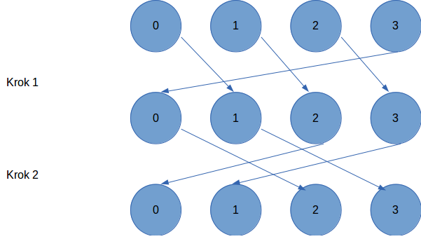

# Wzorce komunikacyjne MPI

Realizacja dwóch zadań skupiających się na zaimplementowaniu określonych schematów komunikacyjnych w programowaniu równoległym.

## Zad 1

Obliczanie NWD wielu liczb jednocześnie z zastosowaniem wzorca _dissemination pattern_.

### Polecenie

Proszę policzyć największy wspólny dzielnik (NWD) poszczególnych liczb całkowitych przechowywanych w różnych procesach używając opisanego poniżej wzorca komunikacyjnego. (W każdym z procesów należy zainicjować lokalną przechowywaną przez niego wartość).

Wzorzec komunikacyjny „upowszechnianie” (dissemination pattern) pozwala każdemu z procesów wyliczyć wartość rozwiązania w maksimum log p krokach komunikacyjnych, gdzie każdy z procesów otrzymuje częściowe wyniki aby wykonać ostateczną ich redukcję na koniec ostatniego przebiegu przesyłu danych.

Jak widać na rys1. (załącznik) zakładamy komunikację pomiędzy procesami po jednokierunkowym okręgu (tzn. prawym sąsiadem n-1 procesu jest proces 0). W pierwszym kroku dane są przesyłane do procesu o 1 większego od procesu wysyłającego, następnie wykonywana jest operacja na danych cząstkowych, w kolejnych krokach do procesu o 2 większego itd. (przesunięcie jest z każdym kolejnym krokiem zwiększane dwukrotnie), aż do pełnej wymiany informacji.

Dla uproszczenia implementacja może ograniczać się do l. procesów będących potęgą 2.



### Pomysł rozwiązania

Problem obliczenia NWD jest równoważny wyszukiwaniu części wspólnej zbiorów.
Przy realizacji zadania można skorzystać z tego, że operacja ta jest przemienna.

W każdej iteracji algorytmu każdy wątek będzie wyznaczał cześć wspólną zbiorów dzielników liczb poprzez obliczenie NWD.
Dzięki zastosowaniu wzorca upowszechniania łączone będą niezależne zbiory.
Dzięki temu ilość zbiorów dla których zostanie policzona część wspólna w n-tym kroku wynosi 2ⁿ.
Pozwoli to na osiągnięcie wyniku w logarytmicznej liczbie kroków.

### Rozwiązanie

Program będący rzowiązaniem zadania znajduje się w katalogu [nwd](./nwd).

Program kożysta z biblioteki MPI. Trzeaba ją **zainstalować** przed kompilacją i uruchomieniem.

#### Kompilacja

Do skomilowanaia programu można wykorzystać narzędzie makfie.

Przykład kompilacji

```bash
make
```

#### Uruchomienie

Program trzeba urchomić przy pomocy polecenia mpirun.  
Liczba procesów musi być równa liczbie argumentów, które stanowią liczby dla których będzie obliczana wspólna wartość NWD.

Liba argumentów musi być **wielokrotnościa liczby 2**.

Przykład uruchomienia

```bash
mpirun -n 4 ./nwd 15 21 24 57
```
