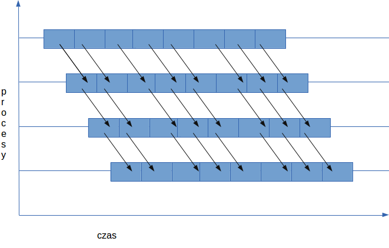

# Wzorce komunikacyjne MPI

Realizacja dwóch zadań skupiających się na zaimplementowaniu określonych schematów komunikacyjnych w programowaniu równoległym.

## Zadanie 1

Obliczanie NWD wielu liczb jednocześnie z zastosowaniem wzorca _dissemination pattern_.

### Polecenie

Proszę policzyć największy wspólny dzielnik (NWD) poszczególnych liczb całkowitych przechowywanych w różnych procesach używając opisanego poniżej wzorca komunikacyjnego. (W każdym z procesów należy zainicjować lokalną przechowywaną przez niego wartość).

Wzorzec komunikacyjny „upowszechnianie” (dissemination pattern) pozwala każdemu z procesów wyliczyć wartość rozwiązania w maksimum log p krokach komunikacyjnych, gdzie każdy z procesów otrzymuje częściowe wyniki aby wykonać ostateczną ich redukcję na koniec ostatniego przebiegu przesyłu danych.

Jak widać na rys1. (załącznik) zakładamy komunikację pomiędzy procesami po jednokierunkowym okręgu (tzn. prawym sąsiadem n-1 procesu jest proces 0). W pierwszym kroku dane są przesyłane do procesu o 1 większego od procesu wysyłającego, następnie wykonywana jest operacja na danych cząstkowych, w kolejnych krokach do procesu o 2 większego itd. (przesunięcie jest z każdym kolejnym krokiem zwiększane dwukrotnie), aż do pełnej wymiany informacji.

Dla uproszczenia implementacja może ograniczać się do l. procesów będących potęgą 2.


### Pomysł rozwiązania

Problem obliczenia NWD jest równoważny wyszukiwaniu części wspólnej zbiorów.
Przy realizacji zadania można skorzystać z tego, że operacja ta jest przemienna.

W każdej iteracji algorytmu każdy wątek będzie wyznaczał cześć wspólną zbiorów dzielników liczb poprzez obliczenie NWD.
Dzięki zastosowaniu wzorca upowszechniania łączone będą niezależne zbiory.
Dzięki temu ilość zbiorów dla których zostanie policzona część wspólna w n-tym kroku wynosi 2ⁿ.
Pozwoli to na osiągnięcie wyniku w logarytmicznej liczbie kroków.

### Rozwiązanie

Program będący rzowiązaniem zadania znajduje się w katalogu [nwd](./nwd).

Program kożysta z biblioteki MPI. Trzeaba ją **zainstalować** przed kompilacją i uruchomieniem.

#### Kompilacja

Do skomilowanaia programu można wykorzystać narzędzie makefile.

Przykład kompilacji

```bash
make
```

#### Uruchomienie

Program trzeba urchomić przy pomocy polecenia mpirun.  
Liczba procesów musi być równa liczbie argumentów, które stanowią liczby dla których będzie obliczana wspólna wartość NWD.

Liba argumentów musi być **wielokrotnościa liczby 2**.

Przykład uruchomienia

```bash
➜ mpirun -n 4 ./nwd 15 21 24 57
GCD of all provided nubmers is 3
```

## Zadanie 2

W wypadku rozsyłania dużych danych często efektywniej jest zastosować wzorzec potokowego przesyłania danych (*pipeline),* gdzie dane (wysyłana wiadomość) są rozdzielane na n fragmentów. W zadaniu tym rozważmy jedno-wymiarową topologię komunikacyjną, gdzie każdy proces wysyła dane tylko do swojego prawego sąsiada. W momencie gdy zostanie otrzymany fragment danych od lewego sąsada jest przesyłany dalej do prawego sąsiada procesu który otrzymał dane, w tym samym momencie zaczyna się odbiór następnej porcji danych. (rys2 - zalacznik).



Celem zadania są dwie rzeczy.

Utworzyć jednowymiarowy komunikator z wirtualną topologią kartezjańską (O toplogiach wirtualnych w MPI możecie Państwo przeczytać np. [tu](https://computing.llnl.gov/tutorials/mpi/#Virtual_Topologies)).

Proszę rozesłać wektor int o rozmiarze 1000000 (podział danych na części po 1000 elementów) z procesu 0 do pozostałych procesów przy użyciu potokowego przesyłania danych (rys). Proszę w tym celu użyć stworzonego przez Państwa komunikatora Kartezjańskiego i funkcji MPI_Cart_shift w celu określenia sąsiedniego procesu. (Procedura ułatwi obsługę warunków brzegowych – dla procesu 0 i n-1 zwracając dla ich sąsiadów wartość MPI_PROC_NULL). (Wysyłanie i odbiór danych z MPI_PROC_NULL jest dozwolony i pozwoli uprościć program).

### Rozwiązanie

Program będący rzowiązaniem zadania znajduje się w katalogu [nwd](./nwd).

Program kożysta z biblioteki MPI. Trzeaba ją **zainstalować** przed kompilacją i uruchomieniem.

Program tworzy comunikator kartezjański oraz przy jego pomocy wykonuje potokowe przesłanie danych.

- Pierwszy proces inicjalizuje vetro zerami,
- Procesy środkowe modyfikują dane poprzez zwiększenie wartości o 1,
- Proces końcowy redukuje wartości do ich sumy

#### Kompilacja

Do skomilowanaia programu można wykorzystać narzędzie makefile.

Przykład kompilacji

```bash
make
```

#### Uruchomienie

Program trzeba urchomić przy pomocy polecenia mpirun.  

Przykład uruchomienia

```zbash
➜ mpirun -n 5 --oversubscribe ./pipeline
Sum of received values: 3000000
```
